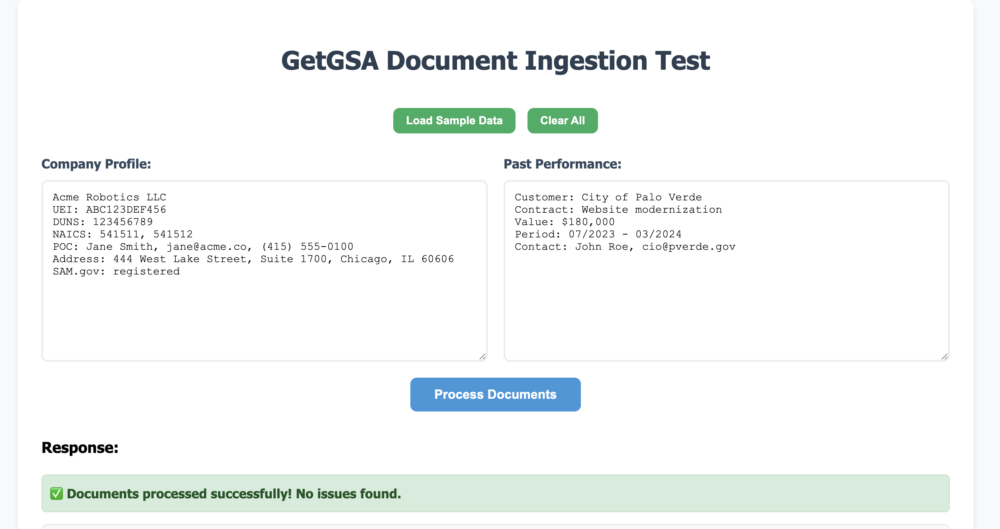

# GetGSA Coding Test - Document Ingestion Service

A FastAPI service that processes company profile and past performance documents, extracts structured data, validates fields, maps NAICS codes to SINs, and generates compliance checklists.

## Features

- **Document Parsing**: Extracts structured data from pseudo-PDF/DOCX text blocks
- **Field Validation**: Validates required fields and flags missing/invalid items
- **NAICS→SIN Mapping**: Maps NAICS codes to recommended SIN codes
- **Compliance Checklist**: Generates checklist showing if required conditions are satisfied
- **REST API**: POST /ingest endpoint returning structured response
- **Web UI**: Simple interface for testing the API
- **Audit Logging**: Logs validation results and outcomes
- **Comprehensive Tests**: Unit test suite covering parsing, validation, and mapping

## API Endpoints

- `POST /ingest` - Main document ingestion endpoint
- `GET /` - API status and version
- `GET /health` - Health check endpoint
- `GET /ui` - Web UI for testing
- `GET /docs` - Swagger UI documentation
- `GET /redoc` - ReDoc documentation

## Screenshot



*The web interface showing successful document processing with sample data. The UI provides text areas for company profile and past performance input, with real-time validation feedback and structured JSON response display.*

## Quick Start

### Prerequisites

- Python 3.11+
- UV package manager (recommended) or pip

### Installation and Running

1. **Clone and setup**:
   ```bash
   cd /path/to/assessment
   ```

2. **Create virtual environment and install dependencies**:
   ```bash
   uv venv
   source .venv/bin/activate
   uv pip install fastapi "uvicorn[standard]" jinja2 python-multipart pytest
   ```

3. **Run the application**:
   ```bash
   python main.py
   ```

4. **Access the service**:
   - API: http://localhost:8000
   - Web UI: http://localhost:8000/ui
   - API Docs: http://localhost:8000/docs

### Web UI Features

The included web interface (`/ui`) provides:
- **Sample Data Loading**: One-click button to load test data
- **Dual Text Areas**: Side-by-side input for company profile and past performance
- **Real-time Processing**: Instant validation and parsing feedback
- **Structured Display**: Formatted JSON response with syntax highlighting
- **Status Indicators**: Clear success/warning/error messaging
- **Mobile Responsive**: Works on desktop and mobile devices

### Running Tests

```bash
# Using the provided script
./run_tests.sh

# Or manually
source .venv/bin/activate
pytest test_main.py -v
```

## Usage Examples

### Sample Data

**Company Profile**:
```
Acme Robotics LLC
UEI: ABC123DEF456
DUNS: 123456789
NAICS: 541511, 541512
POC: Jane Smith, jane@acme.co, (415) 555-0100
Address: 444 West Lake Street, Suite 1700, Chicago, IL 60606
SAM.gov: registered
```

**Past Performance**:
```
Customer: City of Palo Verde
Contract: Website modernization
Value: $180,000
Period: 07/2023 - 03/2024
Contact: John Roe, cio@pverde.gov
```

### API Usage

```bash
curl -X POST http://localhost:8000/ingest \
  -H "Content-Type: application/json" \
  -d '{
    "company_profile": "Acme Robotics LLC\nUEI: ABC123DEF456\nDUNS: 123456789\nNAICS: 541511, 541512\nPOC: Jane Smith, jane@acme.co, (415) 555-0100\nAddress: 444 West Lake Street, Suite 1700, Chicago, IL 60606\nSAM.gov: registered",
    "past_performance": "Customer: City of Palo Verde\nContract: Website modernization\nValue: $180,000\nPeriod: 07/2023 - 03/2024\nContact: John Roe, cio@pverde.gov"
  }'
```

### Response Format

```json
{
  "request_id": "uuid-string",
  "parsed": {
    "company_profile": {
      "company_name": "Acme Robotics LLC",
      "uei": "ABC123DEF456",
      "duns": "123456789",
      "naics": ["541511", "541512"],
      "poc_name": "Jane Smith",
      "poc_email": "jane@acme.co",
      "poc_phone": "(415) 555-0100",
      "address": "444 West Lake Street, Suite 1700, Chicago, IL 60606",
      "sam_registered": true
    },
    "past_performance": {
      "customer": "City of Palo Verde",
      "contract": "Website modernization",
      "value": "$180,000",
      "period": "07/2023 - 03/2024",
      "contact": "John Roe, cio@pverde.gov"
    }
  },
  "issues": [],
  "recommended_sins": ["54151S"],
  "checklist": {
    "required": {
      "has_company_info": {"ok": true, "details": "..."},
      "has_valid_naics": {"ok": true, "details": "..."},
      "has_poc_info": {"ok": true, "details": "..."},
      "has_sam_registration": {"ok": true, "details": "..."},
      "has_past_performance": {"ok": true, "details": "..."}
    },
    "overall": {"ok": true, "total_issues": 0}
  }
}
```

## NAICS→SIN Mapping

| NAICS Code | SIN Code |
|------------|----------|
| 541511     | 54151S   |
| 541512     | 54151S   |
| 541611     | 541611   |
| 518210     | 518210C  |

## Validation Rules

The service validates the following fields:

**Company Profile**:
- Company name (required)
- UEI (required)
- DUNS (required)
- NAICS codes (required, at least one)
- POC name (required)
- POC email (required, valid format)
- POC phone (required)
- Address (required)
- SAM registration status (required)

**Past Performance**:
- Customer (required)
- Contract description (required)
- Contract value (required)
- Contract period (required)
- Contact information (required)

## Testing

The test suite includes:

1. **Document Parsing Tests**: Verify correct extraction of structured data
2. **Validation Tests**: Ensure missing/invalid fields are caught
3. **NAICS Mapping Tests**: Verify correct NAICS→SIN mapping without duplicates
4. **Checklist Tests**: Validate compliance checklist logic
5. **Edge Cases**: Test empty inputs and malformed data

### Test Coverage

- ✅ Missing UEI detection
- ✅ Invalid email detection  
- ✅ NAICS→SIN mapping accuracy
- ✅ Duplicate SIN removal
- ✅ Checklist requirement validation
- ✅ Edge case handling

## Docker Usage

### Build and Run

```bash
# Build the image
docker build -t getgsa-test .

# Run the container
docker run -p 8000:8000 getgsa-test
```

### Using Docker Compose

```bash
# Start the service
docker-compose up -d

# Stop the service
docker-compose down
```

## Audit Logging

The service logs all validation activities to:
- Console output
- `audit.log` file

Log entries include:
- Request ID
- Number of validation issues
- Overall outcome (PASS/FAIL)
- Detailed issue list

## Project Structure

```
.
├── main.py                 # FastAPI application with parsing and validation logic
├── test_main.py            # Comprehensive test suite
├── run_tests.sh            # Test runner script
├── templates/
│   └── index.html         # Web UI for testing
├── pyproject.toml         # Project dependencies
├── Dockerfile             # Docker image configuration
├── docker-compose.yml     # Docker Compose setup
├── audit.log              # Audit log file (generated at runtime)
└── README.md              # This documentation
```

## Development Notes

- **Parsing Strategy**: Uses regex patterns to extract structured data from text
- **Validation**: Comprehensive field validation with specific error codes
- **Logging**: Request-level audit trail for compliance
- **Error Handling**: Graceful handling of malformed inputs
- **Modularity**: Clean separation of parsing, validation, and mapping logic

## Time Investment

This implementation was completed within the 45-60 minute timeframe, focusing on:
1. Core functionality (parsing, validation, mapping)
2. Complete test coverage
3. Clean, modular code structure
4. Working UI and API documentation
5. Docker containerization

The solution prioritizes correctness and code quality while delivering a functional vertical slice of the product.